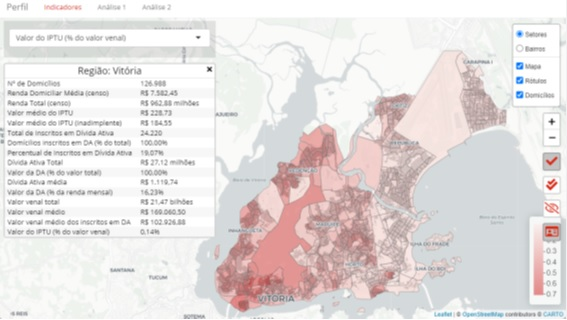

[](https://sonarcloud.io/summary/new_code?id=perfil)

<h1 align="center">Perfil da Dívida Ativa do IPTU</h1>
<p align="center"></p> 


## Descrição e contexto
---
Perfil da dívida ativa do IPTU é uma ferramenta que permite uma avaliação do atual estoque da dívida ativa do IPTU de um município a partir do perfil dos devedores - construído a partir do cruzamento dos dados da Prefeitura com bases externas. A aplicação foi elaborada como uma prova de conceito de uso de dados disponíveis para resolução de problemas urbanos no âmbito da Cooperação Técnica BR-T1496 - Potencializando o uso de Soluções de Big Data para Cidades Inteligentes.

## Guia do usuário
---

A avaliação do perfil da dívida municipal é acessado através de uma interface única intuitiva, a partir da qual cada módulo pode ser acessado.

### Módulo "indicadores"

O módulo "indicadores" permite ao usuário selecionar uma série de indicadores previamente calculados sobre o estoque da dívida e o perfil do contribuinte devedor. A partir da seleção, são exibidas camada sobre o mapa do município contendo a informação escolhida. Todos os dados são apresentados em dois níveis de agregação: setor censitário e bairros. Além da percepção visual do dado, maiores informações são oferecidas ao usuário a partir da seleção de regiões do mapa com cliques do mouse.

### Módulos de análises

Os módulos de análises apresentam estudos feitos a partir dos dados levantados. Esses estudos são relevantes para evidenciar o potencial do uso de dados para sudisidiar a tomada de decisões no processo de formulação de políticas públicas. Atualmente, dois estudos realizados para o município de Vitória-ES estão disponíveis: a avaliação sobre o impacto da regressividade do imposto na estrutura da inadimplência; e o estudo sobre o perfil do inadimplente recorrente.

Novos estudos podem ser criados em documentos R Markdown e facilmente incluidos na aplicação pelo administrador.

## Guia de instalação
---

A implementação da aplicação requer cinco passos:

* Personalização do código;
* Preparação dos dados;
* Execução inicial;
* Implantação do ambiente de visualização;
* Configuração da atualização automática.

### Personalização do código

Pontos fundamentais:

- Clonar o repositório;

- Alterar o arquivo config.R para se adequar ao ambiente desejado.

Observações adicionais:

Para compreender a necessidade de alteração do código, é preciso entender que o mesmo encontra-se dividido em três "fatias" - coleta, manipulação e visualização - cada uma presente em seu próprio diretório.

A "coleta" é responsável por obter todos os dados necessários para a aplicação, tanto os provenientes de bases externas quantos os fornecidos pela prefeitura. A necessidade de alteração dos códigos presentes nesta etapa resultam das peculiaridades de acesso aos dados internos quanto da inclusão de novas bases externas.

Na fatia "manipulação" estão presentes a preparação das variáveis para a adequada exibição, assim como os cálculos de todos os indicadores e análises. Uma vez que seja respeitada a estrutuda dos dados de entrada, modificações só serão necessárias para a inclusão de novos indicadores ou realização de análise personalizadas.

A "visualização" consiste no aplicativo em Shiny que permite o acesso do usuário aos dados calculados. O arquivo "ui.R" deve ser modificado para incluir análises personalizadas.

### Preparação dos dados

Os dados fornecidos pela prefeitura devem ser adequados aos requisitos da aplicação. Na pasta "dados" encontram-se os modelos de dados necessários:

- modelo_dw.xlsx
- bairros.kml
- imoveis.kml

O arquivo modelo_dw.xlsx contém uma pasta do excel onde cada planilha apresenta uma tabela do Datawarehouse da prefeitura. É preciso configurar um acesso ODBC via DSN. O DSN para conexão via ODBC pode ser personalizado no arquivo "config.R". Caso se deseje modificar a forma de acesso a esse conjunto de dados, basta alterar o código do arquivo "coleta/dw_via_odbc.R".

Além dos dados do datawarehouse, é preciso fornecer informações as localizações georreferenciadas dos imóveis do município, além das malhas dos bairros da cidade. Exemplos de arquivos com essas informações também estão presentes na pasta "dados" (bairros.kml e imoveis.kml - esses nomes podem ser personalizados no arquivo "config.R"). A ausência de informações desse tipo não inviabiliza a aplicação, mas requer algumas modificações:

- Todos os imóveis que não tiverem localização georreferenciada serão localizados a partir dos dados fornecidos pela consulta dos endereços constantes no DW ao serviço do OpenStreetMap. É importante ter em mente que, como há o limite de uma solicitação por segundo, o tempo de demora para a utilização desse serviço é elevado.

- Na inexistência da malha dos bairros, a análise poderá ser realizada exclusivamente pelos setores censitários. O código da aplicação, no entanto, não está preparado para funcionar sem essa malha, requerendo modificação nos módulos de coleta/manipulação/visualizacação.

### Executar o script de carga

Após a personalização do código e preparação dos dados, a aplicação deve ser executada no R uma primeira vez a partir do arquivo "carga.R". Esse arquivo irá instalar todas as bibliotecas necessárias e executar as duas fatias da aplicação, terminando com a atualização da fatia de visualização.

### Implantar o ambiente de visualização em um servidor

A implantação da aplicação em um servidor pode ser feita de três formas distintas:

- Via shiny-server:

Após a correta configuração do shiny-server, um link deve ser feito dentro de /srv/shiny-server apontando para a pasta "visualizacao" da aplicação. O nome do link será utilizado para acessar a aplicação pelo navegador (http://exemplo.com/nome_do_link/). 

Além disso, é preciso instalar todos os pacotes requeridos - executando o seguinte comando no servidor:

`sudo su - c "R -e \"source('<CAMINHO DA APLICAÇÃO>/pacotes.R')\""`

- Via RStudio connect:
Não documentado.

- Via shinyapps.io ou serviço similar:
Não documentado.

### Configurar ferramenta de atualização automática

A atualização automática pode ser implementada criando-se um agendamento de tarefa que execute o script de carga pelo R (./carga.R). Os dados são atualizados e a aplicação de visualização no shiny-server é reiniciada em alguns instantes.

Exemplo de código para execução do script no Windows:

```
cd <CAMINHO DA APLICAÇÃO>
For /F "Skip=1 Tokens=2*" %%A In (
    'Reg Query "HKLM\SOFTWARE\R-core\R"^
    /V "InstallPath"2^>Nul'
) Do start "" "%%~B\bin\Rscript.exe" "<CAMINHO DA APLICAÇÃO>/carga.R"
```

### Dependências

A aplicação foi desenvolvida para acessar um Datawarehouse hospedado em um MS SQL Server. No entanto, deve funcionar adequadamente em qualquer base de dados que permita acesso via ODBC.

## Autor
---
[Rodrigo Franklin](mailto:rodrigo.franklin@ufes.br "e-mail")

## Colaborador
---
[Everlam Elias Montibeler](mailto:everlam.elias@ufes.br "e-mail")

## Licença 
---

A documentação de suporte e uso do software está licenciada sob a Creative Commons IGO 3.0 Attribution-NonCommercial-NoDerivative (CC-IGO 3.0 BY-NC-ND).

O código fonte deste repositório utiliza a [AM-331-A3 Software License](LICENSE.md).

## Isenção de responsabilidade

O BID não será responsável, em hipótese alguma, por danos ou indenizações, morais ou patrimoniais; direto ou indireto; acessório ou especial; ou por consequência, prevista ou imprevista, que possa surgir:

i. Sob qualquer teoria de responsabilidade, seja em contrato, violação de direitos de propriedade intelectual, negligência, ou sob qualquer outra teoria; 

ii. Como resultado do uso da Ferramenta Digital, incluindo, mas não limitado a, possíveis defeitos na Ferramenta Digital, ou perda ou imprecisão de dados de qualquer tipo. O anterior inclui despesas ou danos associados a falhas de comunicação e/ou mau funcionamento do computador, vinculados ao uso da Ferramenta Digital.
