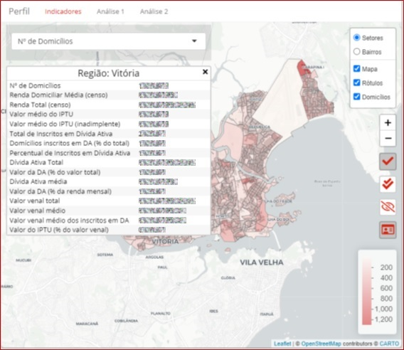

<h1 align="center">Perfil da Dívida Ativa do IPTU</h1>

 

## Descrição e contexto
---
Perfil da dívida ativa do IPTU é uma ferramenta que permite uma avaliação do atual estoque da dívida ativa do IPTU de um município a partir do perfil dos devedores - construído a partir do cruzamento dos dados da Prefeitura com bases externas. A aplicação foi elaborada como uma prova de conceito de uso de dados disponíveis para resolução de problemas urbanos no âmbito da Cooperação Técnica BR-T1496 - Potencializando o uso de Soluções de Big Data para Cidades Inteligentes.

## Guia do usuário
---

A avaliação do perfil da dívida municipal é acessado através de uma interface única intuitiva, a partir da qual cada módulo pode ser acessado.

### Módulo "indicadores"

O módulo "indicadores" permite ao usuário selecionar uma série de indicadores previamente calculados sobre o estoque da dívida e o perfil do contribuinte devedor. A partir da seleção, são exibidas camada sobre o mapa do município contendo a informação escolhida. Todos os dados são apresentados em dois níveis de agregação: setor censitário e bairros. Além da percepção visual do dado, maiores informações são oferecidas ao usuário a partir da seleção de regiões do mapa com cliques do mouse.

### Módulos de análises

Os módulos de análises apresentam estudos feitos a partir dos dados levantados. Esses estudos são relevantes para evidenciar o potencial do uso de dados para sudisidiar a tomada de decisões no processo de formulação de políticas públicas. Atualmente, dois estudos realizados para o município de Vitória-ES estão disponíveis: a avaliação sobre o impacto da regressividade do imposto na estrutura da inadimplência; e o estudo sobre o perfil do inadimplente recorrente.

Novos estudos podem ser criados em documentos R Markdown e facilmente incluidos na aplicação pelo administrador.

## Guia de instalação
---

INTRODUÇÃO
ESTRUTURA DAS PASTAS DO REPOSITÓRIO

CLONAR REPOSITÓRIO

INCLUIR DADOS PRÓPRIOS NA PASTA DADOS

CONFIGURAR DW COM ACESSO VIA ODBC

EXECUTAR O SCRIPT INICIAL

IMPLANTAR AMBIENTE DE VISUALIZAÇÃO EM UM SERVIDOR SHINY.

VIA RSCONECT

VIA SHINYAPPS.IO

VIA SHINY-SERVER

CONFIGURAR FERRAMENTA DE ATUALIZAÇÃO AUTOMÁTICA

Passo a passo de como instalar a ferramenta digital. Nesta seção é recomendado explicar a arquitetura de pastas e módulos que compõem o sistema.

Dependendo do tipo de ferramenta digital, o nível de complexidade pode variar. Em algumas ocasiões pode ser necessário instalar componentes dependentes da ferramenta digital. Se este for o caso, adicione a próxima seção também.

O guia de instalação deve conter especificamente:
- Os requisitos do sistema operacional para a compilação (versões específicas de bibliotecas, software de gerenciamento de pacotes e dependências, SDKs e compiladores, etc.).
- As dependências próprias do projeto, tanto externas quanto internas (ordem de compilação dos submódulos, configuração de localização de bibliotecas dinâmicas, etc.).
- Etapas específicas para a compilação do código fonte e execução de testes unitários caso o projeto os possua.

### Dependências
Descrição dos recursos externos que geram dependência para a reutilização da ferramenta digital (bibliotecas, frameworks, acesso a bancos de dados e licenças para cada recurso). É uma boa prática descrever as versões mais recentes nas quais a ferramenta digital foi testada.

## Autor
---
[Rodrigo Franklin](mailto:rodrigo.franklin@ufes.br "e-mail")

## Colaborador
---
[Everlam Elias Montibeler](mailto:everlam.elias@ufes.br "e-mail")

## Licença 
---

A documentação de suporte e uso do software está licenciada sob a Creative Commons IGO 3.0 Attribution-NonCommercial-NoDerivative (CC-IGO 3.0 BY-NC-ND).

O código fonte deste repositório utiliza a [AM-331-A3 Software License](LICENSE.md).

## Isenção de responsabilidade

O BID não será responsável, em hipótese alguma, por danos ou indenizações, morais ou patrimoniais; direto ou indireto; acessório ou especial; ou por consequência, prevista ou imprevista, que possa surgir:

i. Sob qualquer teoria de responsabilidade, seja em contrato, violação de direitos de propriedade intelectual, negligência, ou sob qualquer outra teoria; 

ii. Como resultado do uso da Ferramenta Digital, incluindo, mas não limitado a, possíveis defeitos na Ferramenta Digital, ou perda ou imprecisão de dados de qualquer tipo. O anterior inclui despesas ou danos associados a falhas de comunicação e/ou mau funcionamento do computador, vinculados ao uso da Ferramenta Digital.
