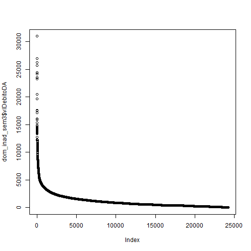
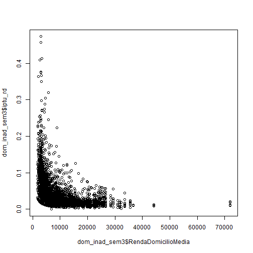
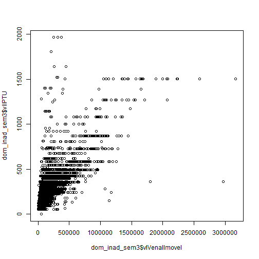
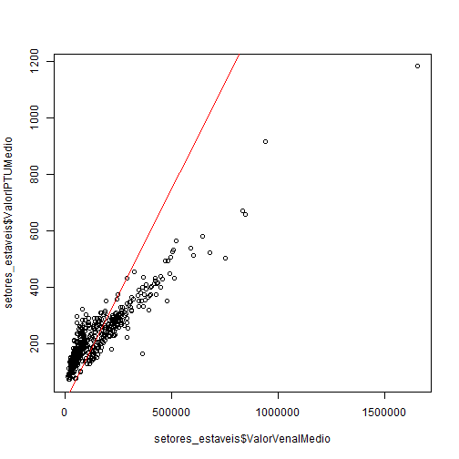
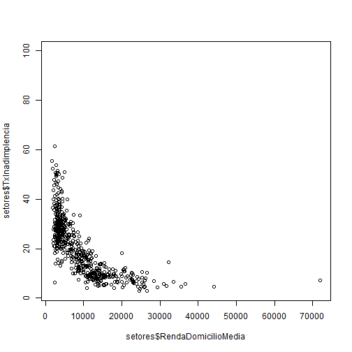
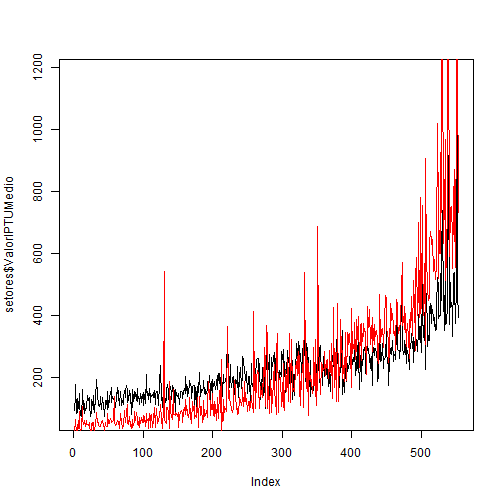

# A regressividade do IPTU em Vitória e o impacto na inadimplência

O total da dívida ativa do IPTU da Prefeitura de Vitória é atualmente de R\$ 61.647.502,13, sendo R\$ 27.120.060,24 (cerca de 43,99%) referente a imóveis residenciais. O montante da dívida ativa do IPTU dos imóveis residenciais representa X% do total cobrado do IPTU. A presente análise busca avaliar formas de reduzir esse nível de inadimplência a partir de uma análise da taxa efetiva do IPTU em contraste com os dados do Censo de 2010.

## Seleção dos dados

Alguns critérios foram aplicados para a seleção dos imóveis incluídos na presente análise:

-   Apenas imóveis residenciais;

-   Eliminação dos 5 maiores devedores

-   Avaliação apenas do setores censitários com crescimento menor do que 100%

-   Sem imóveis não georreferenciados

Uma avaliação da relação entre o valor cobrado do IPTU e o nível de renda mensal médio dos domicílios mostra que o IPTU compromete uma parcela tanto maior da renda quanto menor ela for.

Como consequência, a taxa de inadimplência é mais elevada nas regiões (setores censitários) com menor renda:

Resultado de uma proposição de taxa de iptu neutra:

